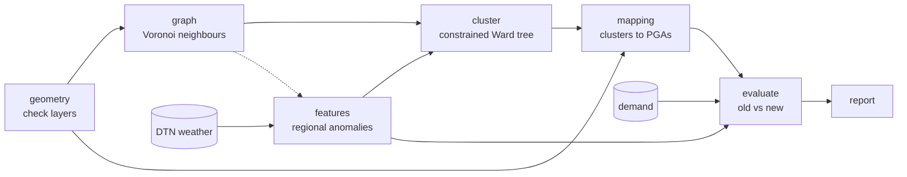
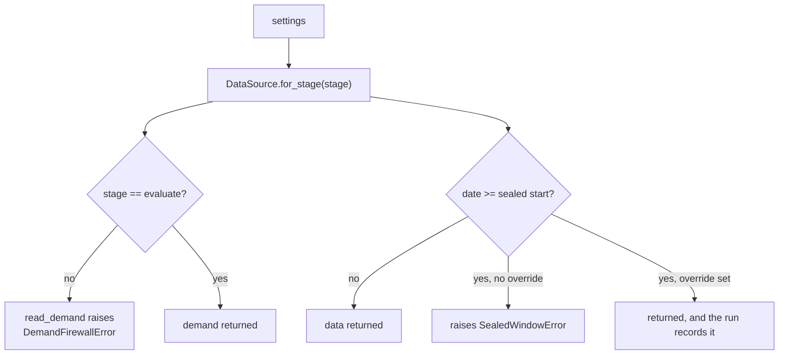
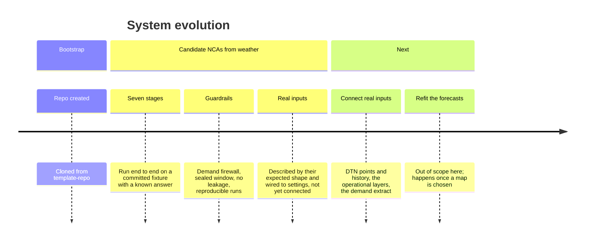

# System Diagram

The living system diagram for this project, in two views:

1. **Graph view**: the seven stages and what flows between them.
2. **Timeline view**: how the system evolves over time (milestones).

Both are written in [Mermaid](https://mermaid.js.org/), so GitHub renders them inline; no image
files to regenerate. Update this document in the same PR as any change that alters the
architecture.

---

## Graph view

Seven stages run in order. Each reads the saved outputs of the stages before
it and saves its own, so any stage can rerun alone.

**Demand enters at one place only: the evaluate stage.** The dotted edge is
the one addition to the flow in the spec: the features stage reads the graph
stage's kept points and cell areas, so the national mean it removes covers
only the points the graph kept, and the cell-area weighted option has areas to
weight by. No weather values cross that edge.

### What each stage saves

| Stage | Saves |
| --- | --- |
| geometry | Cleaned NCA, PGA and RA layers, the service-area outline, a check report |
| graph | Clipped Voronoi cells, the neighbour list, a graph summary |
| features | Regional anomalies for both windows, the stored build-window parameters, the build matrix |
| cluster | The tree, the labels for each saved cut, the diagnostics |
| mapping | PGA and RA assignments with straddle scores, and every move made |
| evaluate | The metrics for both maps, and the random benchmark |
| report | Five maps, the dendrogram, two charts and a one-page summary |

### The two guardrails

---

## Timeline view

