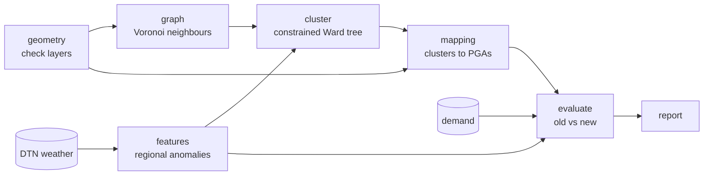

# Spec: NCA regionalisation

2026-09-21 · @Someone

> **Status:** Draft

## Problem

The AA splits the UK into National Climate Areas (NCAs), each made of Patrol Group Areas (PGAs), each made of Rostering Areas (RAs). Demand forecasts run per NCA, so an NCA works best when the places inside it feel the same weather on the same day. This feature builds candidate NCAs from weather alone. It clusters roughly 250 DTN virtual weather points into a dendrogram (a tree recording the order in which points merge) and maps the clusters onto whole PGAs. It then tests, on data kept back from the build, whether the new NCAs are more alike inside and more different from each other than today's, at the same count.

## Scope

### In scope

- All seven stages, run end to end on a committed fixture with a known answer.
- The real inputs, described by their expected shape and wired to settings, but not yet connected.
- The tests under Fixtures and tests.
- The template fill-ins this project needs: the install command in `ops/setup.sh`, the lint and test commands in `ops/check.sh`, and the Run locally and Code style sections of `AGENTS.md`.

### Out of scope

- Redrawing RAs or PGAs: they are fixed operational units.
- Loading real shapefiles, DTN pulls or demand.
- The demand day adjustment.
- Extreme-day flags, a demand-weighted weather index, or other distance measures.
- Refitting the forecast models on the new map.

## Requirements

Each requirement carries a number so tests, the plan and reviews can cite it.

### Build inputs and method

- **R1.** The build follows the decisions in this table. They are settled: Claude Code builds to them rather than reopening them.

| Decision | Choice | Why |
| --- | --- | --- |
| Clustering unit | The DTN virtual points, one row per point | Keeps the weather map independent of today's boundaries |
| Build inputs | Weather only. No demand, no breakdown weights, no current NCA, PGA or RA labels | The map owes nothing to past operational choices, so the demand test stays independent |
| Use of operational layers in the build | Only their dissolved outline, to clip Voronoi cells to the area the AA serves | Geometry, not labels |
| Neighbours | Voronoi cells (the ground nearer a point than any other), clipped to the outline; neighbours share an edge (rook). Island links added by hand in config | Contiguity needs a graph; Voronoi gives one from coordinates alone |
| Features | Daily min and max temperature, rain, wind (plus snow if DTN has it); anomaly from each point's smoothed seasonal normal; national mean anomaly removed each day; z-scored per point and variable | Leaves each point's regional departure, without the annual cycle or nationwide swings |
| National mean | Plain mean across points, or cell-area weighted (config). Never breakdown weighted | The build must not touch demand |
| Method | Ward linkage constrained to the neighbour graph, full tree; unconstrained Ward as a diagnostic | On z-scored series Ward merges by day-aligned correlation, the standard in climate regionalisation |
| Cutting the tree | Replay the first n − k merges for each k; never cut by height | Constrained trees can hold inversions (a later merge at a lower height); merge-order cuts always give exactly k nested clusters |
| Date windows | Build: earliest data to 31 Aug 2024. Held out: 1 Sep 2024 to 31 Aug 2025. Sealed: 1 Sep 2025 to 31 Aug 2026 | Normals and scaling come from the build window only; the sealed window is blocked in code |
| Demand firewall | Only the evaluate stage may read demand; a test enforces it | Built from weather, judged on demand |

### Settings

- **R2.** Every setting below exists in the project's configuration with the default shown; nothing is hard-coded. A real run refuses to start while any required setting is unset and lists them all. Every run records the settings it used.

| Setting | Default | Notes |
| --- | --- | --- |
| Data source | Fixture | Fixture or real |
| NCA, PGA and RA layers | Required | Locations and ID column names; real runs only |
| DTN point list | Required | Point ID, latitude, longitude |
| DTN daily weather | Required | Point ID, date, one column per variable |
| Demand | Required | Read by the evaluate stage only |
| Coordinate systems | Points in latitude and longitude (WGS 84); work in British National Grid (EPSG:27700) | Areas and lengths in metres |
| Build window | Earliest data to 31 Aug 2024 |  |
| Held-out window | 1 Sep 2024 to 31 Aug 2025 |  |
| Sealed window start | 1 Sep 2025 | No data from this date on |
| Sealed-window override | Off | Using it is recorded in the run's outputs |
| Neighbour rule | Rook: a shared edge of at least 1 metre | Queen (any shared point) as the alternative |
| Clipping outline | The dissolved RA layer |  |
| Disconnected parts | Stop | Stop, join with manual links, or make each a fixed region |
| Manual links | None | Pairs of point IDs |
| Variables and transforms | Min and max temperature, wind: none. Rain: log(1 + x) | Add snow if DTN has it |
| Seasonal-normal smoothing | 31 days, wrapping round the year end |  |
| Leap day | Use 28 February's normal |  |
| National mean | Plain mean across points | Or cell-area weighted |
| Missing data | Stop | Stop, drop the day everywhere, or fill from neighbours |
| Number of regions | Required: today's NCA count |  |
| Cuts to save | Required, for example that count ± 2 |  |
| Unconstrained diagnostic | On |  |
| Sensitivity sets | Temperature only; all four variables |  |
| Mapping rule | Area majority |  |
| Repair stranded PGAs | On |  |
| Demand measure | Created demand, deduplicated |  |
| Random partitions | 500, with the seed recorded |  |

### Stages

Seven stages run in order. Each reads the saved outputs of the stages before it and saves its own, so any stage can rerun alone.

Demand enters at one place only: the evaluate stage.

- **R3. geometry.** Reads the NCA, PGA and RA layers, converts them to the working coordinate system and repairs invalid shapes. Checks nesting two ways, by ID columns and by overlay: each RA in exactly one PGA, each PGA in exactly one NCA. Reports sliver areas where a dissolved lower layer and the layer above disagree. Flags PGAs made of more than one piece, and checks today's NCAs are contiguous on the PGA neighbour graph.
- **R4. graph.** Builds Voronoi cells (the ground nearer a point than any other) round the points, over an area wider than the outline, then clips them to the outline. Matches cells to points by location, never by output order. Drops points whose clipped cell is empty (offshore) and records them; flags points outside the outline and cells in several pieces. Treats two points as neighbours when their cells share an edge of at least 1 metre, so floating-point corner contacts don't count. Adds manual links, finds the connected parts and applies the disconnected-parts setting.
- **R5. features.** Reads weather for the build and held-out windows only and applies each variable's transform. Computes each point's seasonal normal per variable: the mean for each calendar day over the build years, smoothed by a 31-day moving average that wraps round the year end. Takes the anomaly (value minus normal), then subtracts each day's mean anomaly across points. Converts each point and variable to z-scores (subtract the mean, divide by the standard deviation) using build-window values only, and applies the stored parameters unchanged to the held-out window.
- **R6. cluster.** Builds the full Ward tree on the build matrix, merging only neighbours. Ward's method merges the pair of clusters whose union least increases the total variance within clusters. Checks first that the neighbour graph is one connected piece, because some implementations add links to finish a tree with no more than a warning. Cuts the tree for each saved k by applying the first n − k merges in order, never by height. Names clusters deterministically, for example by the smallest point ID they contain, and reports inversions: merges lower than an earlier merge they contain.
- **R7. cluster diagnostics.** Runs unconstrained Ward on the same matrix, and constrained Ward on each sensitivity set. Compares each with the main cut by adjusted Rand index (agreement between two labellings: 0 for chance, 1 for identical), listing the points that differ after matching labels.
- **R8. mapping.** Colours cells by cluster, merges them, and overlays PGAs and RAs to get each cluster's share of each unit's area. Each PGA takes its majority cluster; its straddle score, 1 − majority share, shows how far it sits across a weather boundary. Reports clusters that win no PGA and checks the mapped NCAs are contiguous on the PGA graph. If repair is on, moves each stranded PGA to the neighbouring NCA it shares most boundary with, and records every move.
- **R9. evaluate**, the only stage that reads demand. Compares today's map with the new one at today's NCA count, on the held-out window only, and reports:
  - the share of between-point weather variance that cluster membership explains, which tests the tree before any mapping;
  - the ceiling: RA-level weather variance split into within-PGA and between-PGA parts, since no NCA map can touch the within-PGA part;
  - eta-squared (the share of variance lying between groups), computed each day across PGAs with NCA as the group, then averaged, for each weather variable and for day-adjusted demand;
  - the mean within-NCA and between-NCA correlation of PGA series;
  - where both maps fall among random contiguous partitions of the PGA graph at the same count;
  - RA misfits: RAs whose weather correlates better with a neighbouring NCA's mean series than with their own.
- **R10. report.** Draws maps (today's NCAs, new NCAs, point clusters over cells, straddle scores, misfit RAs), the dendrogram with the cut marked, the eta-squared bars and the benchmark histogram, and writes a one-page summary. It uses no web basemaps, so it runs offline.

### Outputs

- **R11.** Each stage saves these outputs in formats a reviewer can open without this code.

| Stage | Output | Contents |
| --- | --- | --- |
| geometry | Cleaned layers | NCA, PGA and RA polygons in the working coordinate system, plus the service-area outline |
| geometry | Check report | Nesting failures, sliver areas, multi-part PGAs, contiguity of today's NCAs, counts |
| graph | Cells | Point ID, clipped cell, area, flags |
| graph | Neighbour list | Point A, point B, shared edge in metres, computed or manual |
| graph | Graph summary | Points kept and dropped, neighbour counts, connected parts |
| features | Regional anomalies | Point ID, date, variable and value, for both windows |
| features | Stored parameters | Normals, means and standard deviations from the build window |
| features | Build matrix | One row per point, one column per variable-day |
| cluster | Tree | Merge order, heights, sizes and leaf IDs |
| cluster | Labels | Point ID and cluster name for each saved cut |
| cluster | Diagnostics | Inversions; agreement with the unconstrained and sensitivity runs; points that differ |
| mapping | Assignments | PGA and RA to new NCA for each cut, with majority share and straddle score |
| mapping | Moves | Each stranded PGA moved, with its old and new NCA |
| evaluate | Metrics | Every statistic in R9, for both maps, with the benchmark distribution |
| report | Figures and summary | Maps, dendrogram, charts and the one-page summary |

### Guardrails

The method's fairness depends on these rules, so tests and run-time checks enforce them rather than trusting whoever runs the code.

- **R12. Demand firewall.** Only the evaluate stage may read demand. A test fails if any other stage can reach the demand input, and a read from anywhere else fails at run time.
- **R13. Sealed window.** Any request for data dated on or after the sealed start fails unless the override is set. Using the override is recorded in the run's outputs.
- **R14. No leakage.** Normals and z-score parameters come from the build window only and are stored; the held-out window reuses them unchanged. Changing held-out weather leaves the tree and labels unchanged.
- **R15. Reproducible runs.** Each run records its settings, the code version and whether there were uncommitted changes, library versions, any random seed and a log. The same inputs and settings give identical outputs.
- **R16. No silent changes.** Dropped points, manual links used, stranded PGAs moved and any missing-data handling are each recorded. Missing data and unset required settings stop the run by default.

### Fixtures and tests

- **R17.** Tests run on a fixture set with a known answer that follows `tests/fixtures/README.md`. Every file is text (CSV or GeoJSON), under 100 KB, made up, and named for the case it exercises. It uses ISO dates, dot decimals and no absolute paths. The set is written from fixed formulas, not a random generator, and never fetched live, so every run replays exactly. It holds:
  - 16 points on a 4 × 4 grid at 25 km spacing, plus one offshore point whose cell clips to nothing and one island point joined by a manual link. Points are stored as latitude and longitude, like the real list.
  - Two planted weather regimes, the west and east halves, with the island in the east. Each series is a seasonal cycle, a national signal, its regime's signal and a small fixed offset per point, all sine waves of fixed periods.
  - Daily weather from 1 Sep 2023 to 31 Aug 2025: one file per variable, one row per day and one column per point, to one decimal place. That keeps each file near 74 KB. It includes 29 Feb 2024, a spell of zero rain, and one missing day at one point.
  - Fixture settings with a one-year build window (1 Sep 2023 to 31 Aug 2024), the standard held-out window, cuts at k = 2 and 3, and the island link.
  - Eight RAs grouped into four PGAs (north-west, north-east, south-west, south-east), and two "current" NCAs split north and south, cutting across the planted regimes.
  - PGA demand as daily percentage deviations that follow the regime signal, again from fixed formulas.
  - The expected cluster labels at k = 2, kept beside the inputs as the expected-output half of the pair.
- **R18.** These tests exist and pass under `ops/check.sh`:

| Test | Checks |
| --- | --- |
| Smoke | The full fixture run completes; every output in R11 exists where expected, has the expected shape and holds no nulls |
| Settings | A real run refuses unset required settings and lists them; the fixture settings load |
| Sealed window | A request for a sealed date fails, and passes only with the override set |
| Graph | Cells tile the outline without overlap; each cell holds its own point; the offshore point is dropped; the island joins by its manual link |
| Features | The daily mean across points is zero after regional anomalies; build-window z-scores have mean 0 and standard deviation 1; normals join smoothly at the year end; the leap day and the missing day follow their settings |
| Cluster | Exactly k clusters per cut; every cluster contiguous; each cut nests inside the one above; at k = 2 the labels match the expected labels exactly |
| Distance | On z-scored rows (population standard deviation), squared Euclidean distance equals 2n(1 − r) per variable, which is why Ward merges by correlation |
| Mapping | Each PGA gets exactly one NCA; the mapped NCAs are contiguous; every move is recorded |
| Evaluate | Eta-squared matches a hand-worked case; random partitions are contiguous with k regions; the new map beats the fixture's current NCAs |
| Firewall | No stage but evaluate can reach the demand input |
| Leakage | Changing held-out weather leaves the tree and labels unchanged |
| Determinism | Two runs with the same inputs and settings give identical outputs |

## Interfaces / files involved

| File | Change |
| --- | --- |
| `src/` | New package: one module per stage, plus settings, run records and one command that runs a single stage or all seven. Names settle in the plan |
| `tests/` | One test file per stage, plus the smoke, firewall, leakage and determinism tests (R18) |
| `tests/fixtures/` | The fixture set (R17), one folder per module or feature under test |
| `ops/setup.sh` | The Python install command in its configuration block |
| `ops/check.sh` | Lint and test commands in its configuration block, so neither step reports SKIP |
| `AGENTS.md` | Fill Run locally and Code style; add the gotchas below |
| `docs/decisions/` | One new record: the weather-only build (R1) |
| `docs/diagrams/system-diagram.md` | The stage flow above, in place of the placeholder |
| `docs/plans/nca-regionalisation.md` | The implementation plan, from `/plan` |

Gotchas to add to `AGENTS.md`, kept short because the file has a 200-line budget:

- Build stages never read demand; only evaluate may (R12).
- Never request data on or after the sealed start; the override needs a human's say-so (R13).
- Normals and scaling come from the build window only (R14).
- Cut the tree by merge order, never by height (R6).
- Real inputs stay unconnected until their shape is described: ask rather than invent schemas.

## Acceptance criteria

- [ ] `ops/check.sh` passes with its lint and test steps configured, not skipped.
- [ ] The fixture run completes, and every output in R11 exists, has the expected shape and holds no nulls.
- [ ] At k = 2 the clusters match the planted west and east halves exactly.
- [ ] The new map beats the fixture's current NCAs on eta-squared, for weather and for demand.
- [ ] The firewall, sealed-window and leakage tests pass.
- [ ] Two runs with the same inputs and settings give identical outputs.
- [ ] A real run with required settings unset stops before doing any work and lists every missing setting.
- [ ] `AGENTS.md` has no `<fill-in>` left in Run locally or Code style.

## End-to-end verification

1. Run `ops/setup.sh`, then `ops/check.sh`: lint and tests pass.
2. Run the pipeline on the fixture with the Run locally command from `AGENTS.md`.
3. Open the run's summary and maps. The new map splits west from east, the fixture's current map splits north from south, and the metrics favour the new map.
4. Open the run record: settings, code version, library versions and the log are all present.
5. Rerun the same command: every output matches the first run exactly.
6. Switch the settings to real data without filling the required settings: the run stops and lists what is missing.

---

*Related plan: `docs/plans/nca-regionalisation.md`*

